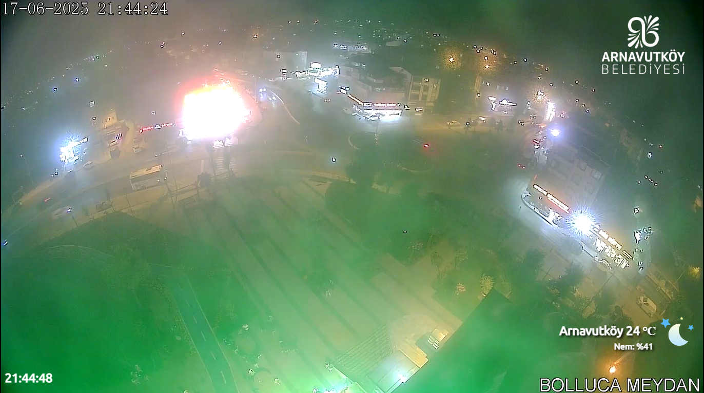
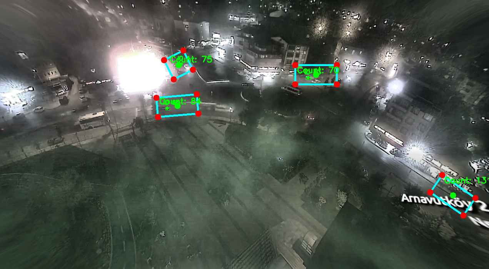

# Vehicle Counter: Pure Image and Video Processing (No AI)

## Overview

This project demonstrates vehicle counting through pure image and video processing techniques without utilizing artificial intelligence. The method relies on classical computer vision algorithms and image processing techniques implemented in Python.

## Features

- **No AI Needed:** Implements traditional image processing methods.
- **Real-time Vehicle Counting:** Capable of counting vehicles from video streams.
- **Robust Detection:** Works effectively in varying light and weather conditions.

## Requirements

- Python 3.x
- OpenCV (`cv2`)
- NumPy

Install dependencies:

```bash
pip install opencv-python numpy
```

## Usage

To run the project:

1. Clone the repository:

```bash
git clone https://github.com/Nonurt/Vehicle-Counter-Pure-mage-and-Video-Proccessing-No-AI.git
```

2. Navigate to the project directory:

```bash
cd Vehicle-Counter-Pure-mage-and-Video-Proccessing-No-AI
```

3. Execute the script:

```bash
python main.py
```

## Results

Below are sample outputs from the project:

| UI & Processed Images & Results |
| ------------------------------- |
|          |
|          |
|          |


## Acknowledgment

This README was generated by AI (ChatGPT).

## License

This project is open-source and available under the MIT License.

