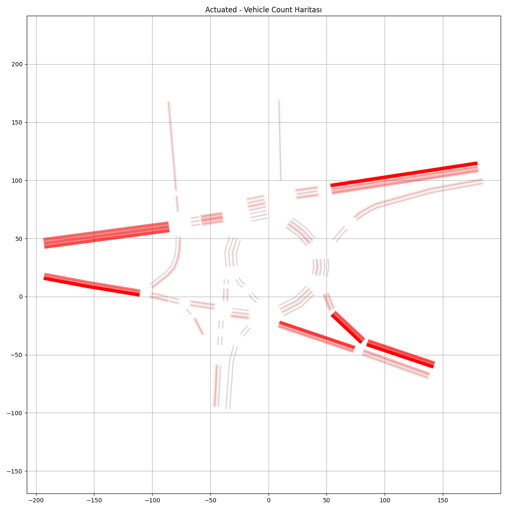
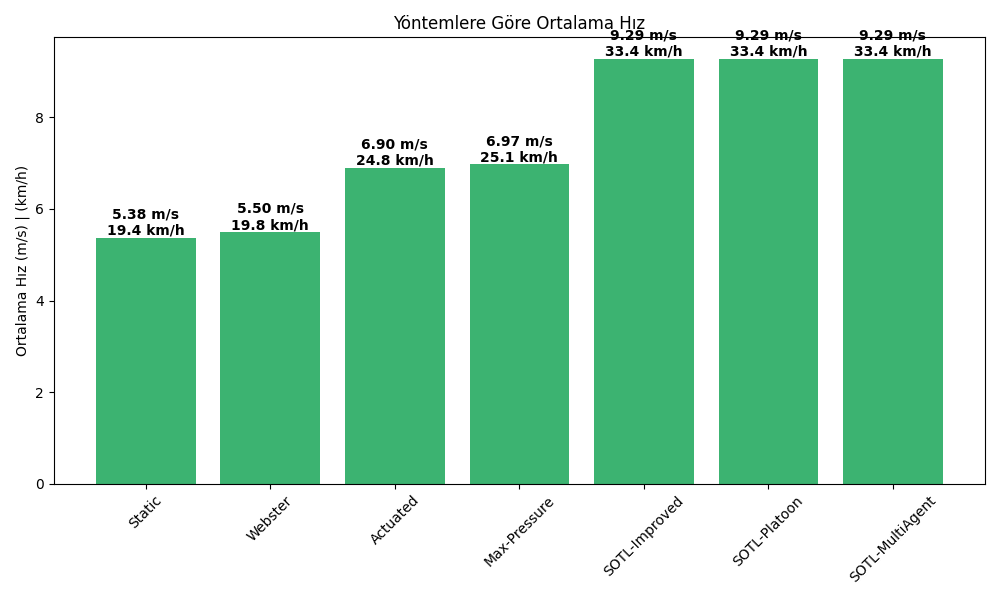
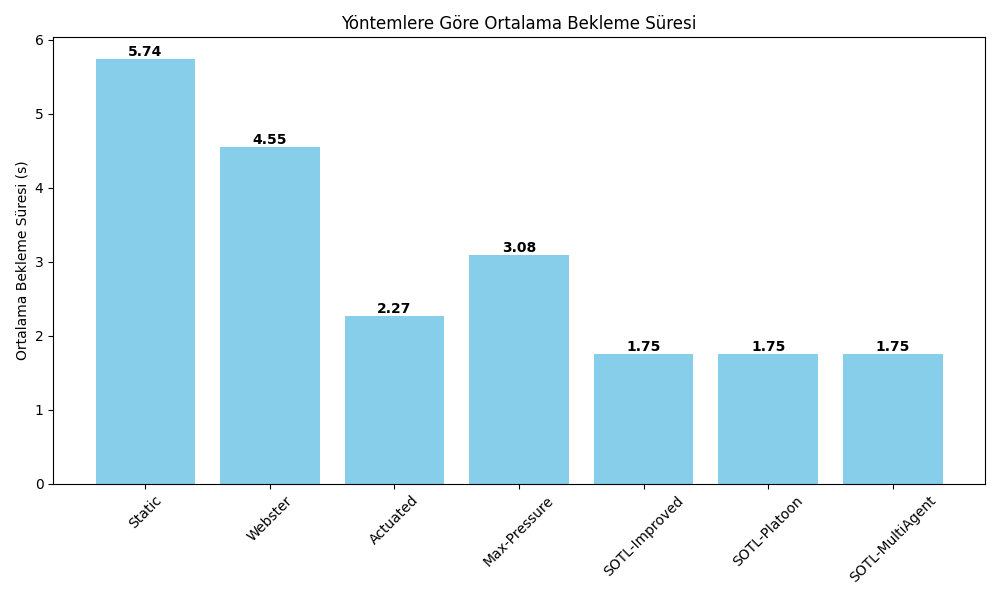
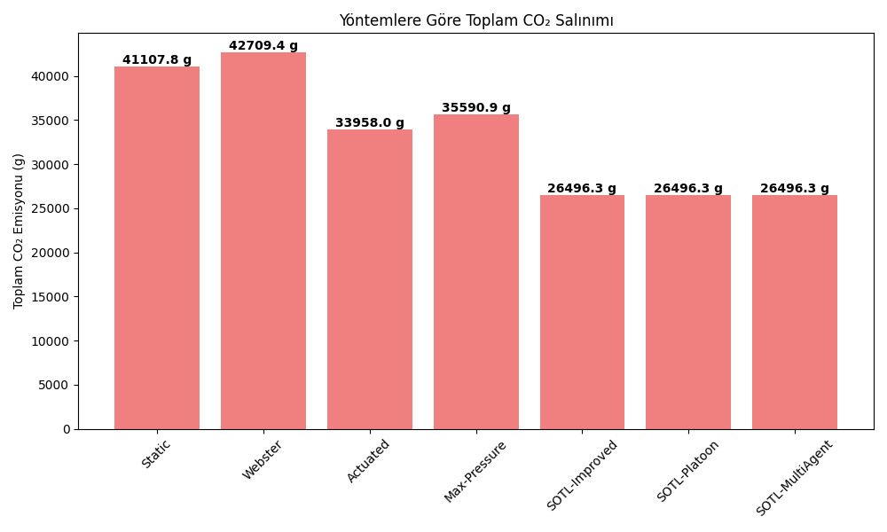
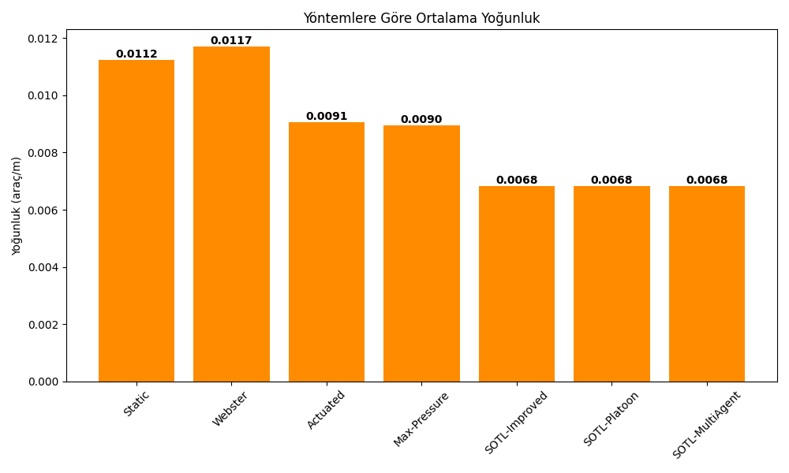
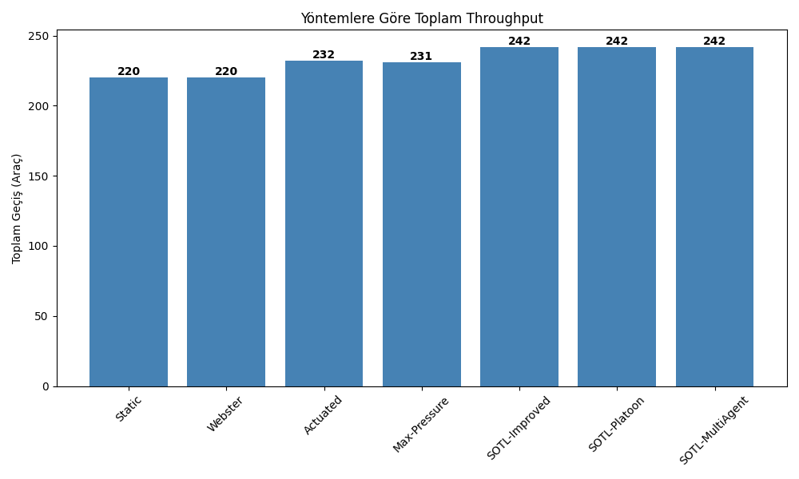
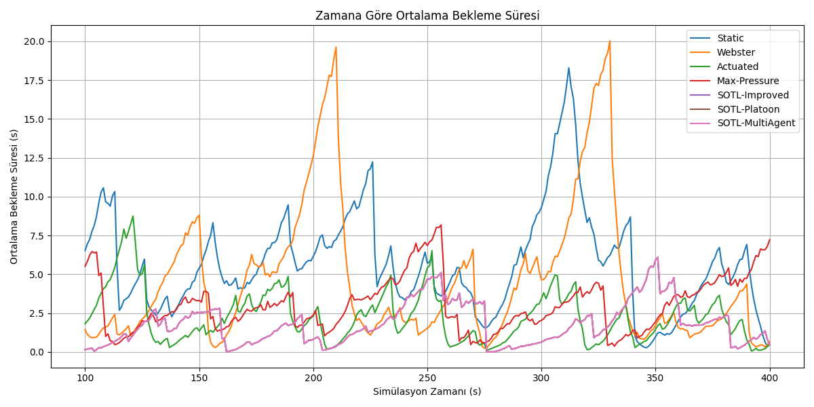

# Traffic Light Control Optimization via SUMO Simulation

(Readme is generated by CHATGPT  --- İYTE EHM BİTİRME PROJESİ 2025 -- )

## Description
This project explores optimization of traffic light control strategies using the SUMO (Simulation of Urban MObility) framework. By simulating realistic traffic flows on road networks, the goal is to reduce average waiting times and improve intersection throughput with various control algorithms.

## Features
- **SUMO Simulation:** Configurable network and route definitions for multiple intersections.
- **Dynamic Control Algorithms:** Scripts implement fixed-time, actuated, and pressure-based control methods.
- **Performance Metrics:** Calculates average delay, queue lengths, and CO₂ emissions per simulation.
- **Visualization:** Generates plots of traffic metrics over time.

## Media
Seven sample network layouts and result snapshots are available in `media/images/`:

  
  
  
  

  
  


## Installation
1. **Clone the repository**  
   ```bash
   git clone https://github.com/Nonurt/Traffic-Light-Control-Optimization-via-SUMO-Simulation.git
   cd Traffic-Light-Control-Optimization-via-SUMO-Simulation
   ```
2. **Create and activate a virtual environment**  
   ```bash
   python3 -m venv venv
   source venv/bin/activate
   ```
3. **Install dependencies**  
   ```bash
   pip install -r requirements.txt
   ```

## Usage
1. **Configure your network** in the `net/` directory (`*.net.xml` and `*.rou.xml`).  
2. **Run simulation scripts**:  
   ```bash
   python run_fixed_time.py --cfg net/intersection.sumocfg
   python run_actuated.py --cfg net/intersection.sumocfg
   python run_pressure.py --cfg net/intersection.sumocfg
   ```
3. **View results** in the `output/` folder or open generated plots in `media/images/`.

## Project Structure
```
Traffic-Light-Control-Optimization-via-SUMO-Simulation/
├── net/                   # SUMO network and route definitions
├── scripts/               # Control algorithm implementations
│   ├── run_fixed_time.py
│   ├── run_actuated.py
│   └── run_pressure.py
├── output/                # Simulation outputs and logs
├── media/                 # Images and snapshots
│   └── images/            # 1.png through 7.png
├── requirements.txt       # Python dependencies
└── README.md              # This file
```

## License
Released under the MIT License.
